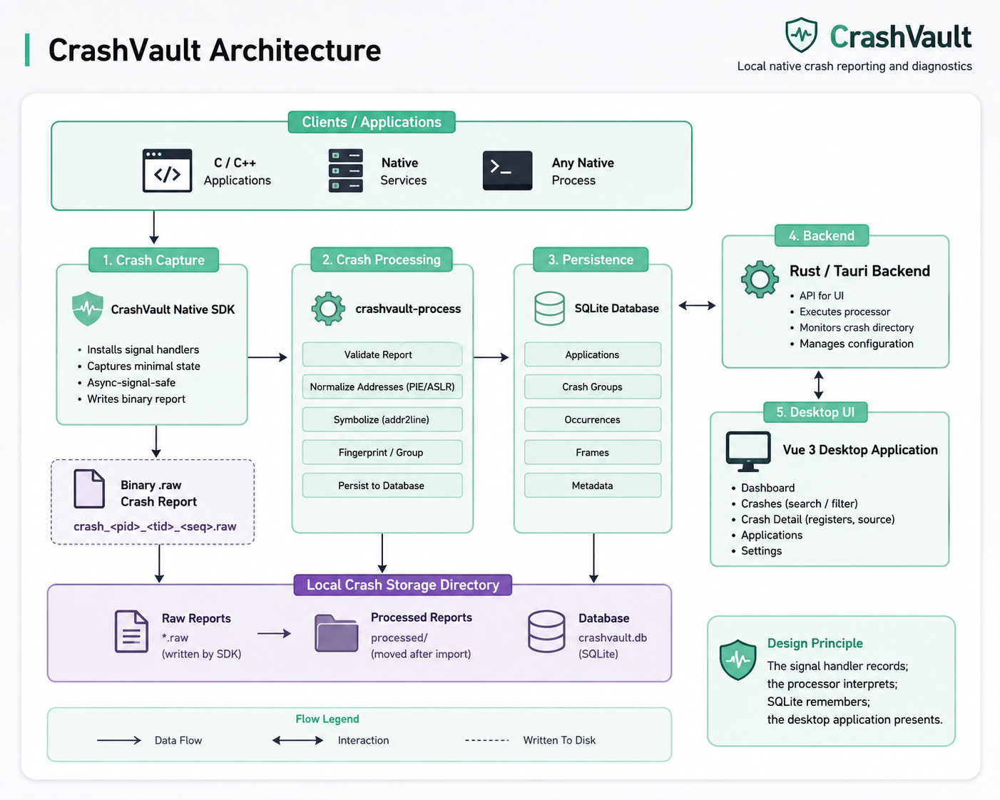

<h1 align="center">CrashVault</h1>

<p align="center">
  <strong>Local native crash reporting and diagnostics for C/C++ applications.</strong>
</p>

<p align="center">
  
</p>

<p align="center">
  Capture fatal crashes. Preserve machine state. Group recurring failures. Inspect everything locally.
</p>

## Overview

A native application can terminate with little more than:

```text
Segmentation fault (core dumped)
```

That message alone does not tell you much about **where the crash occurred, which signal fired, what memory address caused the fault, what the CPU registers contained, or whether the same failure has happened before**.

CrashVault turns native C/C++ crashes into persistent, structured diagnostics.

It captures critical crash state into a compact binary report, processes the report after the crashed application exits, groups recurring failures, stores the results locally in SQLite, and presents them through a desktop interface.

Everything stays local to the machine running CrashVault.

## Features

* Native fatal-signal capture for `SIGSEGV`, `SIGABRT`, `SIGFPE`, and `SIGILL`
* Linux x86-64 register capture, including RIP, RSP, RBP, and general-purpose registers
* Fault-address capture when provided by the operating system
* Fixed binary `.raw` crash reports written by the crash handler
* Executable metadata capture
* PIE/ASLR-aware address normalization
* Deferred crash processing through `crashvault-process`
* `addr2line` function, file, and line symbolization
* Crash fingerprinting and automatic grouping of recurring failures
* SQLite persistence for applications, crash groups, occurrences, and frames
* Idempotent report importing
* Automatic monitoring and importing of new crash reports from the desktop application
* Crash search and application filtering
* Detailed signal, source, register, executable, and occurrence inspection
* Configurable local crash storage
* Local-first architecture with no CrashVault cloud service required

## Architecture

<p align="center">
  
</p>


## Why Deferred Processing?

A fatal signal handler runs at one of the worst possible times to perform complex work: the process may already be in a compromised state.

CrashVault therefore separates **capture** from **interpretation**.

The native handler performs a deliberately small amount of work. It records the available crash metadata and machine state into a fixed binary report before terminating the process.

Operations that are better performed outside the signal context are deferred to `crashvault-process`, including:

* validating the raw report
* normalizing executable addresses
* resolving symbols and source locations
* calculating crash fingerprints
* grouping recurring crashes
* updating SQLite

This design keeps the crash-time path small while allowing richer diagnostics to be reconstructed safely after the failed process has exited.

## Desktop Interface

CrashVault provides five focused views for inspecting local crash data.

### Dashboard

Provides an at-a-glance view of captured crash activity, including crash counts and recent failures.

### Crashes

Displays grouped crashes with application filtering and search so recurring failures can be found quickly.

### Crash Detail

Provides the diagnostic context for a crash group, including:

* signal information
* fault address
* application and executable information
* captured frame
* function and source location when available
* executable-relative offset
* x86-64 register state
* occurrence information

### Applications

Groups captured crash information by application and provides application-level occurrence totals.

### Settings

Controls the crash storage directory, automatic importing, and processor configuration used by the desktop application.

---

## Getting Started

CrashVault currently targets **Linux x86-64** for native crash capture.

On Windows, the current desktop workflow runs CrashVault through **WSL2 + WSLg**.

### Prerequisites

To build the complete project from source, you will need:

* a Linux x86-64 environment
* a C compiler such as GCC
* CMake
* binutils / `addr2line`
* Rust and Cargo
* Node.js and npm
* GTK3 and WebKitGTK dependencies required by Tauri
* WSL2 + WSLg when using CrashVault from Windows

CrashVault uses SQLite for local persistence. If a suitable system SQLite installation is unavailable during the native build, the current build configuration can obtain the SQLite amalgamation automatically.

### Clone the Repository

```bash
git clone <your-repository-url>
cd CrashVault
```

Replace `<your-repository-url>` with this repository's GitHub URL.

### Build the Native Components

From the repository root:

```bash
cmake -S . -B build
cmake --build build -j
```

The native build produces the CrashVault SDK and processor, including:

```text
build/libcrashvault.a
build/libcrashvault_processor.a
build/crashvault-process
```

### Build the Desktop Application

From the repository root:

```bash
cd desktop
npm ci
npm run tauri:build
```

Use the full Tauri production build for the desktop application. Building the Rust crate alone with `cargo build --release` is not a substitute for this step because the production frontend assets must also be bundled into the application.

### Launch on Windows

After building CrashVault, the normal Windows entry point is:

```text
desktop/CrashVault.vbs
```

Double-click `CrashVault.vbs` from File Explorer. It launches CrashVault through WSL/WSLg without leaving a terminal window open.

If startup fails and you need diagnostic output, use:

```text
desktop/CrashVault.bat
```

The `.bat` launcher keeps the console visible so startup errors can be inspected.

### Launch Directly from WSL

From the repository root:

```bash
./desktop/launch.sh
```

---

## Integrating CrashVault

CrashVault is designed to be initialized by the native C/C++ application you want to monitor.

### Minimal C Example

```c
#include "crashvault.h"

static void run_app(void)
{
    /* Your application code */
}

int main(void)
{
    CrashVaultConfig config = {
        .app_name = "MyApplication",
        .version = "1.0.0"
    };

    if (crashvault_init(&config) != 0) {
        return 1;
    }

    run_app();

    crashvault_shutdown();
    return 0;
}
```

`crashvault_init()` installs CrashVault's crash handling for the process. If a supported fatal signal occurs afterward, CrashVault records the available diagnostic state before the process exits.

Call `crashvault_shutdown()` during normal application shutdown.

### Compile and Link

After building the native CrashVault library, a simple C application can be compiled from the repository root with:

```bash
gcc -g \
    -I native \
    my_app.c \
    build/libcrashvault.a \
    -ldl \
    -o my_app
```

Debug information is strongly recommended:

```text
-g
```

CrashVault uses `addr2line` during post-crash processing, so debug symbols allow it to resolve much more useful function, file, and source-line information.

### Capture a Crash

Run the instrumented application normally:

```bash
./my_app
```

If it encounters one of CrashVault's supported fatal signals, the handler writes a report with a name similar to:

```text
crash_<pid>_<tid>_<seq>.raw
```

By default, CrashVault uses:

```text
$HOME/.crashvault
```

The storage location can also be overridden using:

```bash
export CRASHVAULT_HOME=/path/to/crash-storage
```

The target application and CrashVault desktop application should use the same crash storage directory.

When automatic importing is enabled in the desktop application, CrashVault detects pending `.raw` reports and processes them into its local database.

---

## Crash Processing and Storage

CrashVault keeps the crash pipeline local and file-based.

A configured crash directory contains the important runtime state:

```text
.crashvault/
├── crash_<pid>_<tid>_<seq>.raw
├── crashvault.db
└── processed/
```

### Raw Reports

The native handler writes fixed binary `.raw` reports containing the captured crash state.

### Processing

`crashvault-process` reads pending reports and performs the post-crash work required to make them useful:

```text
.raw report
    │
    ├── validate
    ├── normalize addresses
    ├── symbolize
    ├── fingerprint
    ├── group
    └── persist
         │
         ▼
     crashvault.db
```

After a report has been successfully imported, it is moved into the `processed/` directory.

### SQLite

CrashVault stores processed information in:

```text
crashvault.db
```

The database tracks:

* applications
* crash groups
* individual occurrences
* captured frames

Repeated imports of the same report are handled idempotently so an already-imported crash is not counted again.

---

## Symbolization

A raw instruction address alone is difficult to use during debugging.

CrashVault uses executable metadata captured at crash time and normalizes addresses for PIE/ASLR before passing the resulting executable-relative location to `addr2line`.

With suitable debug symbols, this allows an address to be resolved into information such as:

```text
process_item
/path/to/application.c:42
```

The Crash Detail view presents this information alongside the captured registers, fault address, and occurrence data.

---

## Project Structure

```text
CrashVault/
├── native/
│   ├── crashvault.c
│   ├── crashvault.h
│   ├── crashvault_report.h
│   ├── processor.c
│   ├── processor.h
│   ├── processor_main.c
│   ├── symbolize.c
│   └── symbolize.h
│
├── desktop/
│   ├── CrashVault.vbs
│   ├── CrashVault.bat
│   ├── launch.sh
│   ├── scripts/
│   ├── src/
│   └── src-tauri/
│
├── CMakeLists.txt
├── .gitignore
└── README.md
```

Generated build output such as `build/`, `desktop/node_modules/`, `desktop/dist/`, and Rust/Tauri `target/` directories is not part of the source tree.

---

## Tech Stack

| Layer                | Technologies             |
| -------------------- | ------------------------ |
| Native crash capture | C11, POSIX/Linux signals |
| Crash processing     | C, `addr2line`, SQLite   |
| Persistence          | SQLite                   |
| Desktop backend      | Rust, Tauri 2            |
| Frontend             | Vue 3, TypeScript, Vite  |
| Windows workflow     | WSL2, WSLg               |

---

## Known Limitations

CrashVault is currently focused on demonstrating a local native crash-reporting pipeline rather than providing a cross-platform production crash-reporting service.

Current limitations include:

* Native crash capture currently targets **Linux x86-64**.
* Stack capture currently records a **single instruction frame (RIP)** rather than performing full stack unwinding inside the crash handler.
* Function, file, and source-line symbolization depends on available debug symbols and `addr2line`.
* Symbolization of code inside shared libraries or system libraries may be less complete than symbolization of the main executable.
* The current Windows desktop workflow requires **WSL2 + WSLg**.
* AppImage execution under WSL is affected by a WebKitGTK injected-bundle issue, so the direct production Tauri binary is the preferred WSL launch path.

CrashVault is intentionally local-first: crash reports, processed diagnostics, and the SQLite database remain on the local machine.
